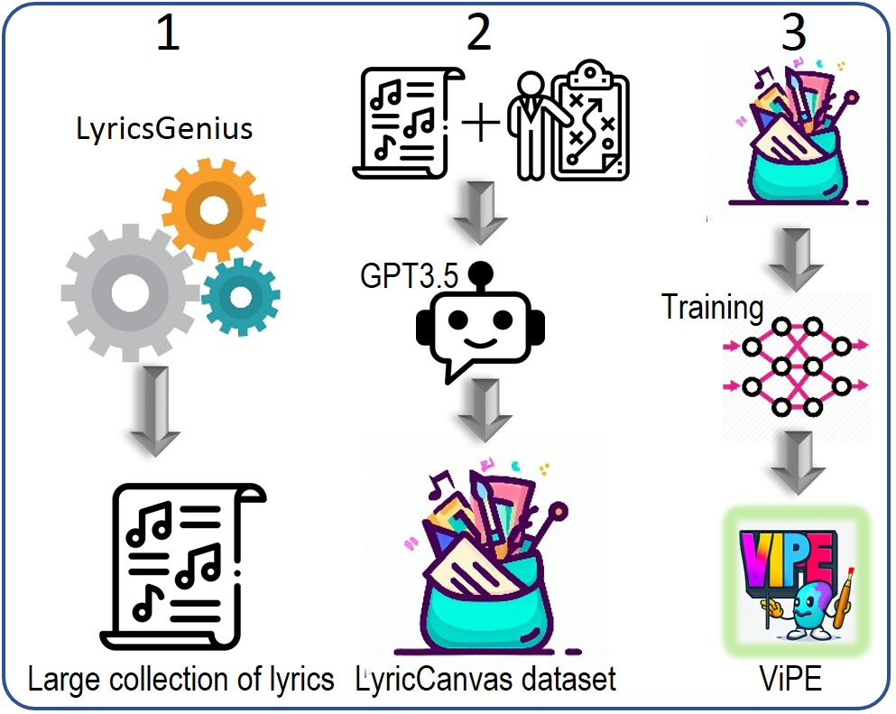
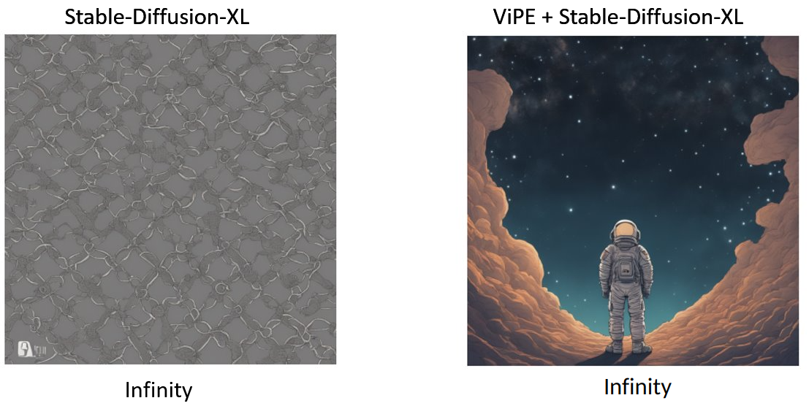

<div>
<div align='center'>
<h2 align="center"> ViPE: Visualize Pretty-much Everything </h2>
<h3 align="center"></h3>
</div>
<div>
<div align="center">
<!--     <a href='https://uni-tuebingen.de/fakultaeten/mathematisch-naturwissenschaftliche-fakultaet/fachbereiche/informatik/lehrstuehle/computergrafik/lehrstuhl/'> Computer Graphics Group, University of Tübingen </a>&emsp; -->
 

<div style="text-align:center">
 

</div>

### [ViPE Paper](https://arxiv.org/abs/2310.10543) | [Music Video Generation](https://github.com/Hazel1994/ViPE-Videos)  | [LyricCanvas Dataset](https://huggingface.co/datasets/fittar/lyric_canvas) | [Use in Huggingface](https://huggingface.co/fittar/ViPE-M-CTX7) | [Prompt Generation Demo](https://huggingface.co/spaces/fittar/ViPE)
</div>

ViPE is a model for translating any arbitrary piece of text into a visualizable prompt. It helps any text-to-image model in figurative or non-lexical language visualizations. Below is a comparison between SDXL with and without ViPE given ***infinity*** as a prompt.

</div>
<div align="center">
   

</div>

### Building ViPE involves three main steps
- **Data Collection**: Scraping all the English lyrics from the Genius platform, preprocessing and noise removal
- **Synthetic Label Generation**: Applying GPT3.5 Turbo to generate visual translation (elaborations) for the lyrics based on human instructions and the context of the
songs. Compiling the LyricCanvas dataset comprising of 10M samples.
- **Training:** Obtaining a robust and lightweight model by training GPT2 on the LyricCanvas dataset with causal language modeling objective conditioned on the lyrics

### Navigate the Repository Based on the following structure
🗄 Code Structure

```
├── ViPE
│   ├── training                      <- Train ViPE from scratch
│   ├── lyric_canvas                  <- Build the LyricCanvas dataset
│   │── evaluation                    <- User study, profanity check, and extrinsic evaluations
│   └── inference                     <- Use the pre-trained ViPE for prompt generation
```


### Citation

If you found ViPE useful, please consider citing:
```
@inproceedings{shahmohammadi-etal-2023-vipe,
    title = "{V}i{PE}: Visualise Pretty-much Everything",
    author = "Shahmohammadi, Hassan  and
      Ghosh, Adhiraj  and
      Lensch, Hendrik",
    editor = "Bouamor, Houda  and
      Pino, Juan  and
      Bali, Kalika",
    booktitle = "Proceedings of the 2023 Conference on Empirical Methods in Natural Language Processing",
    month = dec,
    year = "2023",
    address = "Singapore",
    publisher = "Association for Computational Linguistics",
    url = "https://aclanthology.org/2023.emnlp-main.333",
    pages = "5477--5494"
}
```
