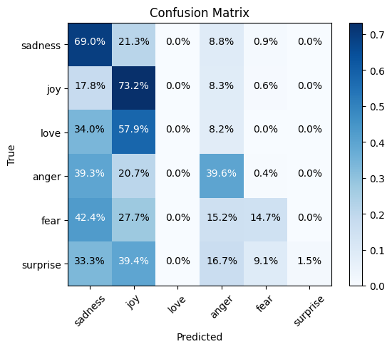

## Emotion Visualization
Given a set of tweets labeled with 6 different types of emotions, we introduce two metrics

### Semantic Proximity
- Generate deterministic prompts from each tweet using ViPE and ChatGPT
- Train and evaluation a BERT model on the prompts with the initial labels
- This will measure the degree to which the prompts convey the emotion in the original tweets

```bash
python semantic_proximity.py --model_name <vipe or chatgpt> --batch_size <for prompt generation>
```
The above script will use the `chatgpt` prompts available in the prompts folder and generate new prompts using ViPE if they don't already exist.
It will then train and evaluate the BERT model under similar conditions and save the results in each folder accordingly.

The results should closely follow those reported in the paper.
```bash
Epoch 1/5 -
 Train Loss: 0.4046 -
 Valid Loss: 0.3399 -
 Accuracy: 0.5710
Epoch 2/5 -
 Train Loss: 0.3291 -
 Valid Loss: 0.3159 -
 Accuracy: 0.5920
Epoch 3/5 -
 Train Loss: 0.3033 -
 Valid Loss: 0.3133 -
 Accuracy: 0.5990
Epoch 4/5 -
 Train Loss: 0.2834 -
 Valid Loss: 0.3120 -
 Accuracy: 0.6010
```
Results for ChatGPT
```bash
Epoch 1/5 -
 Train Loss: 0.4332 -
 Valid Loss: 0.3945 -
 Accuracy: 0.4785
Epoch 3/5 -
 Train Loss: 0.4013 -
 Valid Loss: 0.3661 -
 Accuracy: 0.5065
Epoch 4/5 -
 Train Loss: 0.3950 -
 Valid Loss: 0.3581 -
 Accuracy: 0.5420

```
#### Confusion matrix
After saving the results, you may generate the confusion matrix for each model as
```bash
python confusion_matrix.py --model_name <vipe or chatgpt>
```
<div style="display: flex;">
    <div style="flex: 50%; padding: 5px;">
        
    </div>
    <div style="flex: 50%; padding: 5px;">
        
    </div>
</div>

### Visual Peceptibility
- Generate deterministic prompts from each tweet using ViPE and ChatGPT
- Generate images for each prompt deterministically using Stable Diffusion 2
- Encode the images and prompts using the CliP image and text encoders
- Measure the cosine similarity between the image and text embeddings
- This will measure the degree to which the prompts are faithful to the generated images

#### Image Generation
   ```bash
   python image_generation.py --model_name <vipe or chatgpt> --saving_dir <where to save the images> --batch_size <for image genration>
   ```
This will generate images deterministicly from the generated prompts in the previous steps.

#### CliP Score
Once you have the images and the prompts, compute the  visual Peceptibility scores as

  ```bash
   python clip_score.py --model_name <vipe or chatgpt> --saving_dir <saving_dir used for image_generation.py> --batch_size <default=8>
   ```
which should create a 'clip_score' directory for each model with the results.
