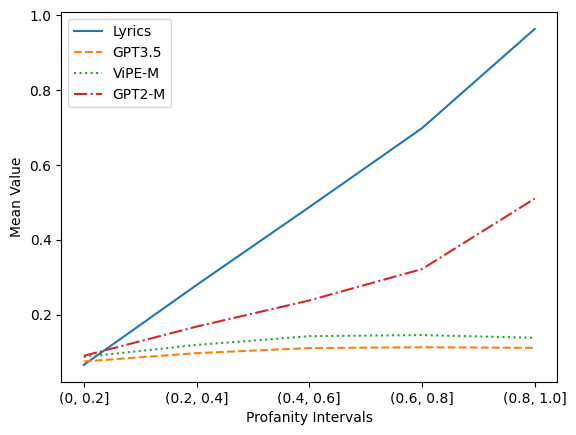

---

## Profanity Assessment

We utilize the [alt-profanity-check](https://pypi.org/project/alt-profanity-check/) library to gauge the profanity score of generated prompts.

## Process Overview

1. Profanity scores of the lyrics are calculated at varying intervals with escalating scores.
2. Identical lyrics are provided to ViPE and ChatGPT for prompt generation.
3. The profanity score of the resulting prompts is then computed accordingly.

## Replicating the Results

- Find the generated prompts for ViPE and GPT2 in the `prompts` directory.
- Upon obtaining the complete LyricCanvas dataset, execute the following script:
```bash
python profanity_check.py --lyric_canvas_path <path to LyricCanvas dataset>
```
- This will generate the *profanity_check.png* figure in your current directory.
- To regenerate ViPE prompts, delete the *vipe_list* within the prompts folder.

---


